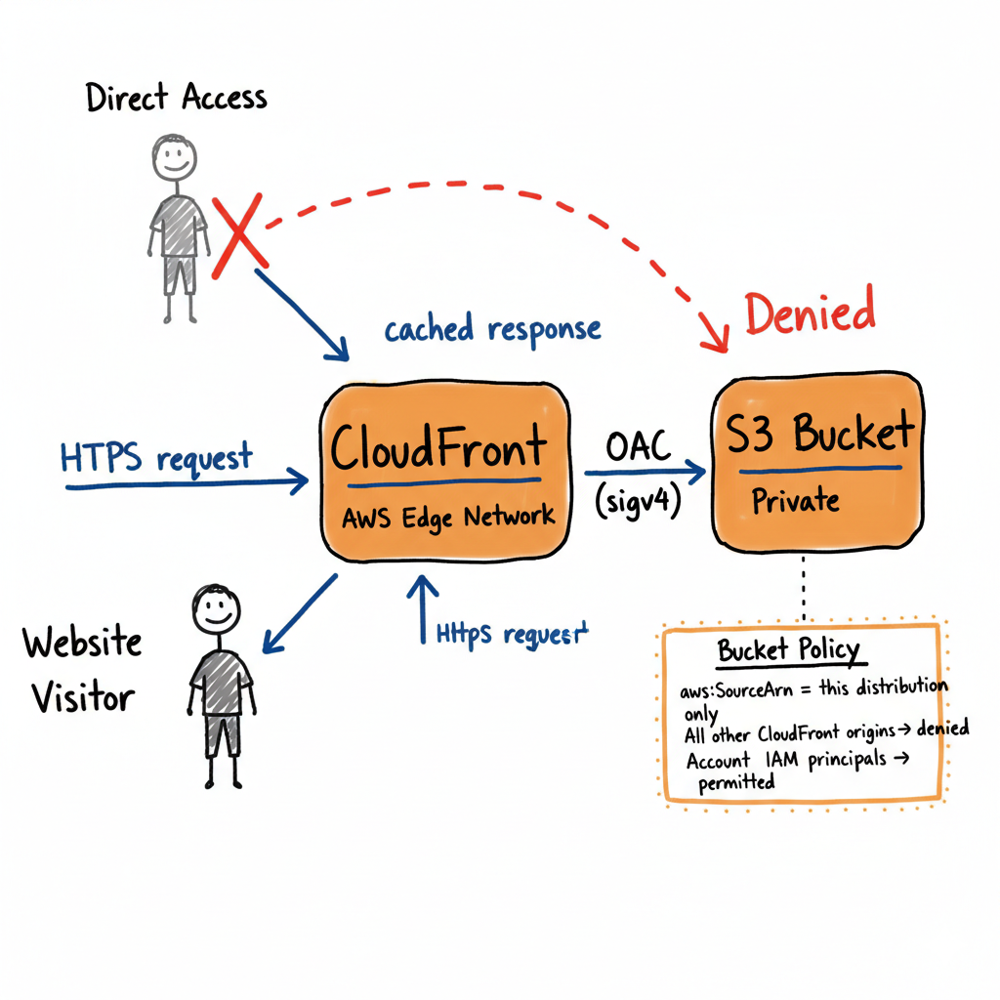

# Terraform AWS Static Website

[](https://github.com/mikmorley/terraform-aws-static-website/actions/workflows/terraform-validation.yml)
[](LICENSE)
[](https://terraform.io/)
[](https://registry.terraform.io/providers/hashicorp/aws/latest)

Hosting a static website on AWS the right way involves more than dropping files in an S3 bucket. You need a CloudFront distribution in front of it, an origin access policy that prevents direct bucket access, a bucket policy with the right conditions, public access blocks, versioning, error page handling, and certificate configuration. Done manually, that is a dozen resources and several security decisions that are easy to get wrong.

This module packages all of that into a single, well-tested block. Two required variables and you have a production-grade static website on AWS global infrastructure.

```hcl
module "website" {
  source = "mikmorley/static-website/aws"

  name        = "my-website"
  environment = "Production"
}
```



## Why use this module

**Secure by default.** The S3 bucket is never publicly accessible. Access is restricted to a specific CloudFront distribution using Origin Access Control (OAC) and `aws:SourceArn` scoping in the bucket policy, so other distributions cannot access your bucket even if misconfigured.

**Up to date.** The module uses OAC rather than the deprecated Origin Access Identity (OAI), the AWS managed `CachingOptimized` cache policy rather than the legacy `forwarded_values` block, and `BucketOwnerEnforced` ownership controls rather than ACLs.

**Registry compliant.** No provider block is declared inside the module. You configure the provider in your root module, which means the module works correctly across multi-region and multi-account setups and supports provider aliasing.

**Flexible.** Bring your own bucket by setting `s3_bucket_name`, use a custom domain with an ACM certificate, inject your own tags, choose a CloudFront price class to control cost, or wire up Route 53 alias records using the `cloudfront_hosted_zone_id` output.

## Features

- Private S3 bucket with all public access blocked
- CloudFront Origin Access Control (OAC) scoped to this distribution
- Bucket policy denies all access except from the specific distribution and account IAM principals
- HTTPS enforced with minimum TLS 1.2
- Custom 403/404 error pages
- S3 versioning enabled
- Works with an existing bucket or creates a new one
- Custom domain and ACM certificate support (optional)

## Quick Start

```hcl
provider "aws" {
  region = "us-east-1"
}

module "website" {
  source = "mikmorley/static-website/aws"

  name        = "my-website"
  environment = "Production"
}
```

No certificate is required for the default CloudFront domain. Supply `cloudfront_certificate_arn` only when using custom aliases.

## Usage Examples

### Custom Domain with SSL Certificate

```hcl
provider "aws" {
  region = "us-east-1"
}

module "website" {
  source = "mikmorley/static-website/aws"

  name        = "company-website"
  environment = "Production"

  cloudfront_aliases         = ["www.example.com", "example.com"]
  cloudfront_certificate_arn = "arn:aws:acm:us-east-1:123456789012:certificate/abcd1234-a123-456a-a12b-a123b4cd56ef"
}
```

### Route 53 Alias Record

The module outputs `cloudfront_hosted_zone_id` for use with Route 53 alias records:

```hcl
resource "aws_route53_record" "www" {
  zone_id = var.hosted_zone_id
  name    = "www.example.com"
  type    = "A"

  alias {
    name                   = module.website.cloudfront_url
    zone_id                = module.website.cloudfront_hosted_zone_id
    evaluate_target_health = false
  }
}
```

### Using an Existing S3 Bucket

```hcl
module "website" {
  source = "mikmorley/static-website/aws"

  name           = "company-website"
  s3_bucket_name = "my-existing-bucket"
  environment    = "Production"
}
```

## Architecture

This module creates the following AWS resources:

- **S3 Bucket**: Private bucket for static content (created unless `s3_bucket_name` is provided)
- **S3 Bucket Policy**: Allows access only from the CloudFront distribution and account IAM principals
- **S3 Bucket Versioning**: Object versioning for content history
- **S3 Public Access Block**: Prevents any public access configuration
- **CloudFront Distribution**: Global CDN with OAC-based S3 origin
- **CloudFront Origin Access Control**: Sigv4-signed requests scoped to this distribution

## Requirements

| Name | Version |
|------|---------|
| terraform | >= 1.0 |
| aws | >= 5.0 |

## Inputs

| Name | Description | Type | Default | Required |
|------|-------------|------|---------|----------|
| name | Name of the stack/project. Used for resource naming and tagging. | `string` | `"static-website"` | no |
| environment | Environment for tagging. Must be `Development`, `Staging`, or `Production`. | `string` | `"Production"` | no |
| s3_bucket_name | Existing S3 bucket to use. If empty, a new bucket is created as `{name}-{account_id}`. | `string` | `""` | no |
| cloudfront_aliases | Alternate domain names for the CloudFront distribution. | `list(string)` | `[]` | no |
| cloudfront_certificate_arn | ACM certificate ARN for CloudFront HTTPS. Must be in us-east-1. Required when `cloudfront_aliases` is set. | `string` | `null` | no |
| cloudfront_price_class | CloudFront price class. `PriceClass_100` covers US/EU (cheapest), `PriceClass_200` adds more regions, `PriceClass_All` uses all edge locations. | `string` | `"PriceClass_100"` | no |
| tags | Additional tags to merge with module-managed tags (`Name`, `Environment`, `ManagedBy`). | `map(string)` | `{}` | no |
| upload_sample_files | When true, uploads sample `index.html` and `error.html` files to the bucket. | `bool` | `false` | no |

## Outputs

| Name | Description |
|------|-------------|
| cloudfront_url | Domain name of the CloudFront distribution |
| cloudfront_distribution_id | Identifier for the CloudFront distribution |
| cloudfront_hosted_zone_id | Hosted zone ID of the CloudFront distribution, required for Route 53 alias records |
| s3_bucket_name | Name of the S3 bucket |
| s3_bucket_arn | ARN of the S3 bucket |
| s3_bucket_domain_name | Bucket domain name of the S3 bucket |
| origin_access_control_id | ID of the CloudFront origin access control |

## Security

**Access control**: The bucket policy has two statements. The first allows `s3:GetObject` from the CloudFront service principal, conditioned on `aws:SourceArn` matching this specific distribution. The second denies all other access unless the request comes from an IAM principal in the same AWS account.

**HTTPS**: CloudFront redirects all HTTP to HTTPS and enforces TLS 1.2 minimum.

**Custom certificates**: ACM certificates must be issued in `us-east-1` (CloudFront requirement).

**Error pages**: 403 and 404 responses are mapped to `error.html` to avoid leaking bucket structure.

## Custom Domain Setup

1. Request an ACM certificate in `us-east-1`:
   ```bash
   aws acm request-certificate \
     --domain-name example.com \
     --subject-alternative-names www.example.com \
     --region us-east-1
   ```

2. Set `cloudfront_aliases` and `cloudfront_certificate_arn` in the module block.

3. Create DNS records pointing to the CloudFront distribution. Use Route 53 alias records (with `cloudfront_hosted_zone_id`) for the apex domain, or CNAME records for subdomains.

## Contributing

Contributions are welcome. Please submit pull requests to the `main` branch.

## License

This project is licensed under the MIT License - see the [LICENSE](LICENSE) file for details.

## Author

**Michael Morley**
- Email: [michael@morley.cloud](mailto:michael@morley.cloud)
- Website: [https://michael.morley.cloud](https://michael.morley.cloud)
- GitHub: [@mikmorley](https://github.com/mikmorley)

## Support

- [Report Issues](https://github.com/mikmorley/terraform-aws-static-website/issues)
- [View Documentation](https://github.com/mikmorley/terraform-aws-static-website)
- [Request Features](https://github.com/mikmorley/terraform-aws-static-website/issues)
